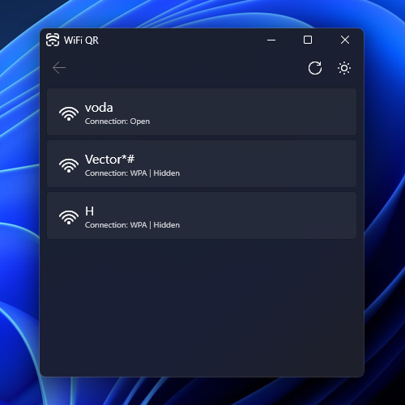
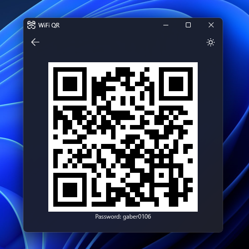

## wifi-qr

A small Windows utiliy to show a QR code for the stored WiFi connections.

## Screenshots

|                            |                            |
| :------------------------: | :------------------------: |
|  |  |

## Development

1. [Install Rust](https://www.rust-lang.org/tools/install)
2. `cargo run`
